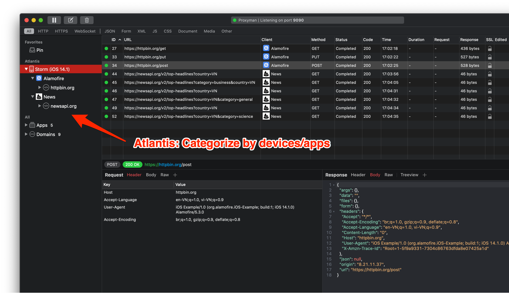

# Atlantis for iOS

# #1.什么事？

一个轻量级且功能强大的iOS框架，用于拦截来自iOS应用的HTTP/HTTPS和WS/WSS流量。没有更多的混乱与代理，证书配置。

* ** Github **: <https://github.com/ProxymanApp/atlantis>

# #2.受益？

* 自动拦截所有 ** HTTP/HTTPS ** 流量。
* 自动拦截 ** WebSocket ** 从iOS设备。
* 支持iOS物理设备和模拟器
* ** 不需要 ** 配置HTTP代理，安装或信任任何证书
* 查看来自 [Proxyman](https:// proxyman.io/) 的macOS应用的流量日志。
* 按应用程序和设备对日志进行分类。


** 亚特兰蒂斯 ** 仅适用于 ** 网络检查员 **。如果您将使用调试工具，如地图本地，断点，地图远程，脚本，网络限制和反向代理...请考虑使用普通代理。


# #3.如何安装

请在Github页面上查看最新更新: <https://github.com/ProxymanApp/atlantis>
