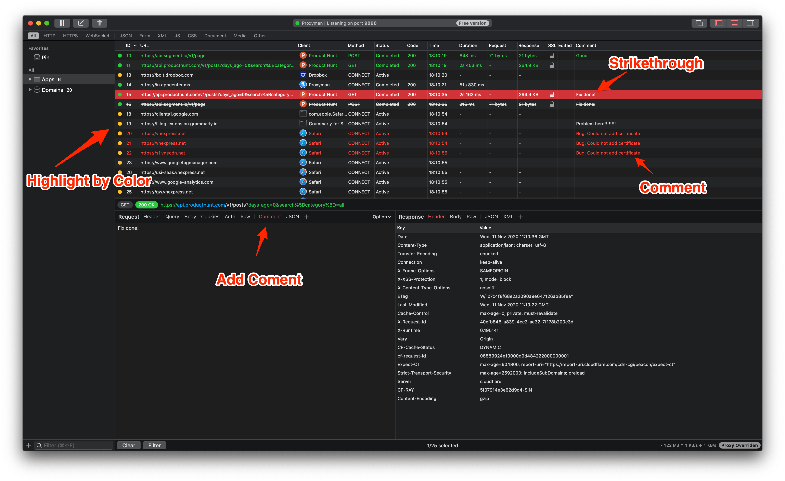
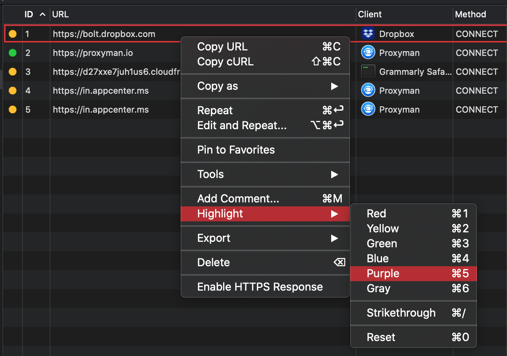

# 按颜色突出显示并添加注释

# #1.什么事？

你可以

* ** 突出显示 ** 具有预定义 ** 颜色的单个或一组请求 ** (红色，黄色，绿色，蓝色，紫色，灰色)
* 加 ~~ 删除线 ~~
* 添加注释
* 按颜色或注释过滤 (CMD F)
* 使用颜色和注释导出 (仅支持Proxyma日志格式)

# #2.受益？

* 轻松标记您的失败，成功的请求/响应与醒目的颜色
* 在开发过程中添加注释。
* 与您的同事分享 (颜色和评论)
* 通过颜色轻松过滤掉请求/响应或推荐

3 \。捷径？

Proxyman支持许多快捷方式，以帮助您快速突出显示或添加注释。

| Shotcut | 目的 |
| ------- | -------------------------------- |
| ⌘ 1 | 用红色突出显示 |
| ⌘ 2 | 用黄色突出显示 |
| ⌘ 3 | 用绿色突出显示 |
| ⌘ 4 | 用蓝色突出显示 |
| ⌘ 5 | 用紫色突出显示 |
| ⌘ 6 | 用灰色突出显示 |
| ⌘ 0 | 全部重置 |
| ⌘/ | 添加删除线样式 |
| ⌘ m | 向选定请求添加注释 |

